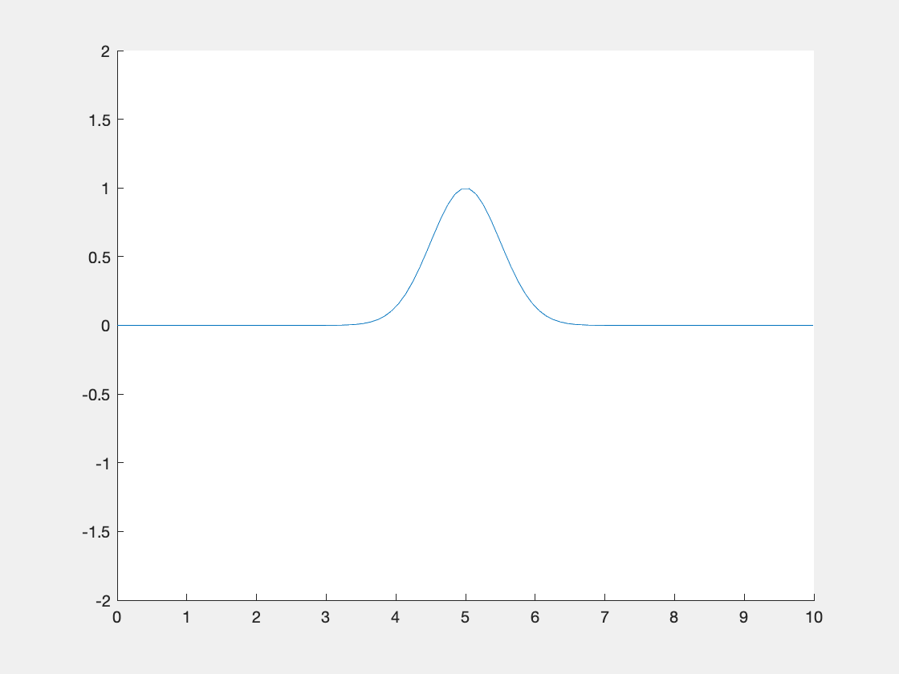

# Finite Elements and Finite Differences

Simple Matlab Project which implements Finite Elements and Finite Differences to solve (one-dimensional) differential equations with Matlab.
Based on the Lecture __Mathematik Fachvertiefung__ at TU Wien.

## Structure

* `Doc` : All the documentation stuff is written in Latex and stored here. Everything is written in German.
* `Matlab`: Here all matlab scripts and outputs are saved.
* `Netgen`: Some results using Netgen and Matlab's `pdetool`.

## Content

`Matlab/FDM.m` Calculates the distribution of the electrical field inside a cylincracal capacitor using Finite Differences.

`Matlab/FEM.m` Example of the 1D wave-equation with a fixed and free end. Solved with Finite Elements and Time-Stepping.

Details in the [Documentation](Doc/document.pdf) (german).

## Examples

## ToDo's

Increasing rounding (?) errors lead to instabilities for long FEM simulations.

## Useful Resouces

* Numerik 18: Die Methode der Finiten Elemente (german): ![https://www.youtube.com/watch?v=2JgZGHUEJWE]
* MIT: Computational Science & Engineering 1: ![https://itunes.apple.com/at/podcast/computational-science-and-engineering-i/id354869177?mt=2]
